# A2A 信息架构（IPO）

## 1. 概述

本文档描述当前 A2A 工程的 IPO（Input-Process-Output）信息架构，帮助统一理解系统的数据输入、处理链路与输出结果。

## 2. IPO 信息架构图

```mermaid
flowchart LR
  %% Input
  subgraph I[Input 输入层]
    I1[用户行为输入\n- 登录信息\n- 人格测试答案\n- 地图点击/交互]
    I2[聊天与意图输入\n- 用户对 Agent 消息\n- 触发对话参数 agent1/agent2/scene]
    I3[系统配置输入\n- DEEPSEEK_API_KEY\n- 模型/端口/CORS 环境变量]
  end

  %% Process
  subgraph P[Process 处理层]
    P1[前端 Web 应用\nReact Router + 页面状态]
    P2[API 适配层\nagentApi.ts 发起 HTTP 请求]
    P3[FastAPI 接口层\n/api/agents /api/dialog /api/events /api/chat]
    P4[Agent Runtime 核心\nAgentPool + CampusAgent]
    P5[LLM 调用层\nAsyncOpenAI -> DeepSeek]
    P6[事件与会话管理\nGlobalDialogHistory 内存队列]
    P7[自动调度\n每 8 秒随机 Agent 对话]
  end

  %% Output
  subgraph O[Output 输出层]
    O1[前端展示输出\n- Agent 列表\n- 对话气泡/事件流\n- 角色聊天回复]
    O2[API 响应输出\nJSON code/data/reply/next_since]
    O3[运行输出\n控制台日志 + 打包后静态页面托管]
  end

  I --> P
  P --> O
```

## 3. 说明

- 当前工程是 Web 前端 + FastAPI Agent Runtime 的单体演示形态。
- 对话事件和历史状态主要保存在内存中，尚未接入持久化存储链路。
- `infra/docker-compose.dev.yml` 中的 PostgreSQL、Redis、MinIO 当前主要用于后续扩展预留。
